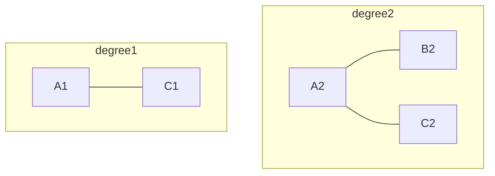
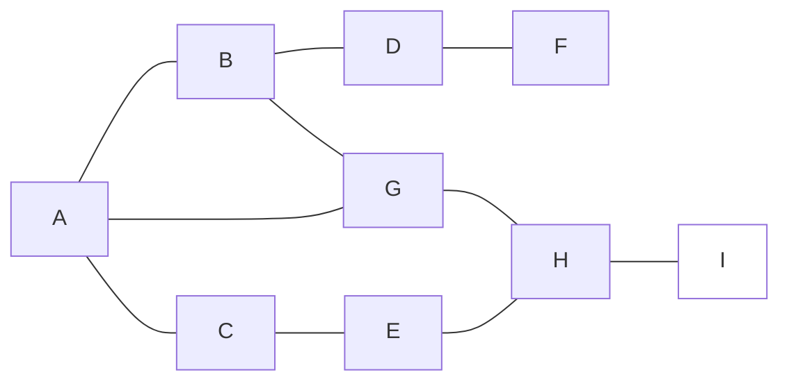
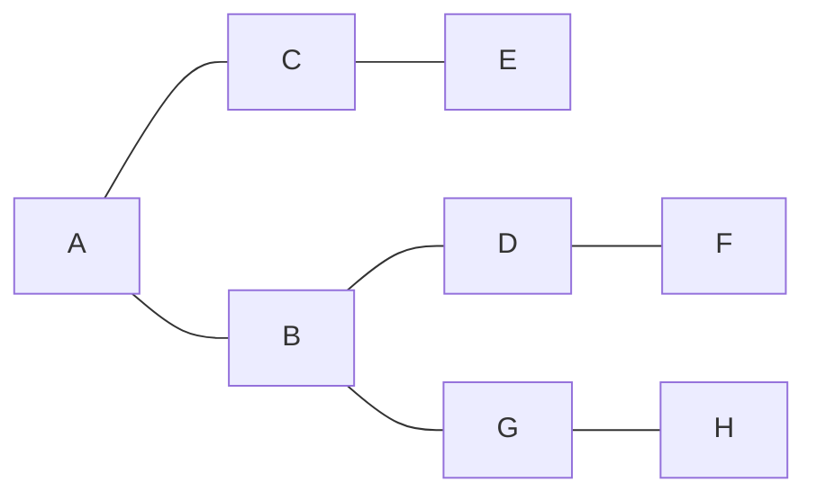

# Maximum-leaf-spanning-tree

###### tags: `Spanning Tree` `algorithm`

## Description:

Giving and undirected connedted graph using **adjacency matrix** A(n*n). Find a spanning tree which degree more then 1 nodes are minimum(i.e. maxmum leaf).  
  
But this graph has some rules. First not all nodes need to be connected in final spanning tree. Its depend on spanning tree if the node is **unnecessary** you can chose either include or not include.  
The other rule is the definition of degree you can see the degree to learn more.  

### Necessary and Unnecessary

### Degree

## Excample:
### Input data  
9 // It means this graph has 9 nodes  
0 1 1 0 0 0 1 0 0  
1 0 0 1 0 0 1 0 0  
1 0 0 0 1 0 0 0 0  
0 1 0 0 0 1 0 0 0  
0 0 1 0 0 0 0 1 0  
0 0 0 1 0 0 0 0 0  
1 1 0 0 0 0 0 1 0  
0 0 0 0 1 0 1 0 1  
0 0 0 0 0 0 0 1 0  
1 1 1 1 1 1 1 1 0 // A,B,C,D,E,F,G,H is necessary node  
0 // End

### Grahp

### Spanning Tree

Because nodes A,B,C,D,G degree more then 1  
**Ans : 5**
## Solution:
See main.cpp