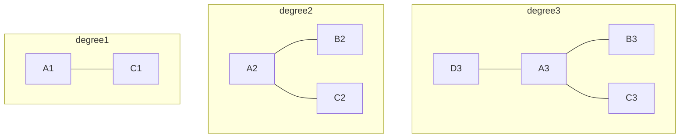
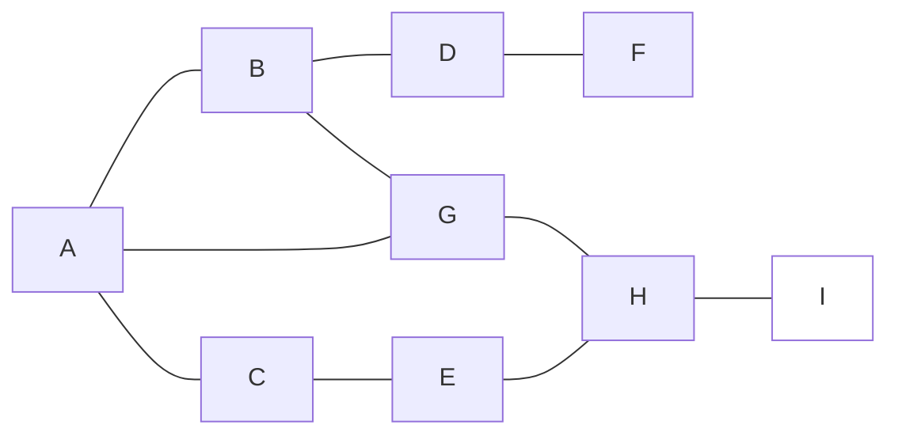
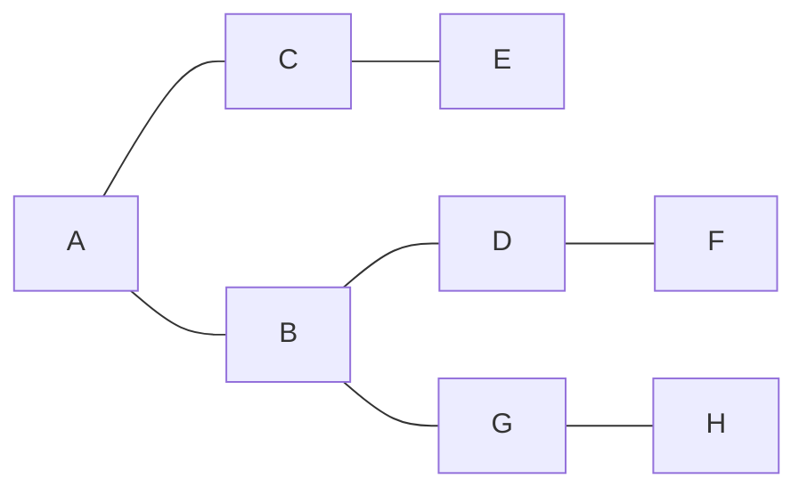

# Maximum-leaf-spanning-tree

###### tags: `Spanning Tree` `algorithm`

**Warning : If pictures are not working, click on [GitHub+Mermaid](https://chrome.google.com/webstore/detail/github-%20-mermaid/goiiopgdnkogdbjmncgedmgpoajilohe) to add this expansion**

## Description:

Given an undirected connedted graph G, represented by an **adjacency matrix** A(n*n). Please find a tree T that has the maximal number of leaves and contains all the vertices in S. Note that the vertices in G\S may or may not be in the tree T.
  
For the definition of degree, see the Wikipedia [page](https://en.wikipedia.org/wiki/Degree_(graph_theory)).

### Necessary and Unnecessary

### Degree

## Example:
### Input data  
9 **// It means this graph has 9 vertices**  
0 1 1 0 0 0 1 0 0  
1 0 0 1 0 0 1 0 0  
1 0 0 0 1 0 0 0 0  
0 1 0 0 0 1 0 0 0  
0 0 1 0 0 0 0 1 0  
0 0 0 1 0 0 0 0 0  
1 1 0 0 0 0 0 1 0  
0 0 0 0 1 0 1 0 1  
0 0 0 0 0 0 0 1 0  
1 1 1 1 1 1 1 1 0 **// A,B,C,D,E,F,G,H are necessary vertices**  
0 **// End**

### Grahp

### Spanning Tree

Because A,B,C,D,G are vertices that have degree more then 1  
**Ans : 5**
## Solution:
See main.cpp
